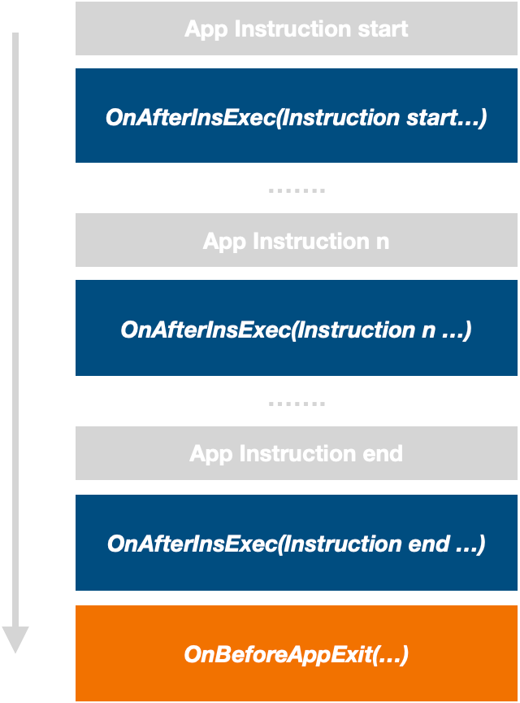
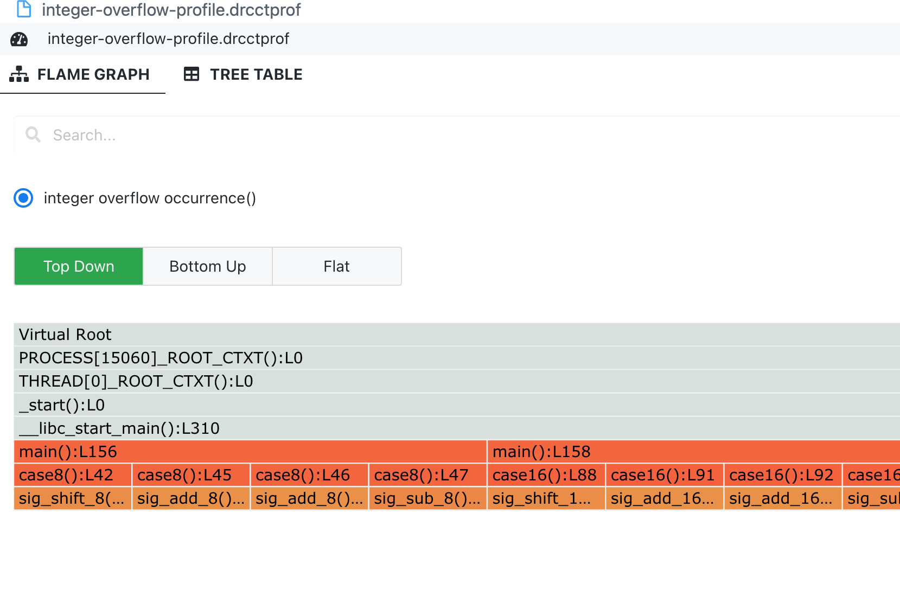

# Framework of Integer Overflow Detection Tool

This is a framework used for the final project of NCSU CSC412/512.

- Please see the [doc](https://xl10.github.io/CSC412-512-project3-Integer-overflow) for detail requirement.

## Build

Use the following commands to get source code and build:

```console
$ git clone --recurse https://github.ncsu.edu/qzhao24/csc_412_512_final_project.git
```

```console
$ ./build.sh
```

## Build Client Tool

You need to finish the function of [bool IntegerOverflow(Instruction *instr, uint64_t flagsValue)](https://github.ncsu.edu/qzhao24/csc_412_512_final_project/blob/main/src/profiler.cpp#L40-L44) in [src/profiler.cpp](https://github.ncsu.edu/qzhao24/csc_412_512_final_project/blob/main/src/profiler.cpp). The function has two arguments: instr is a pointer to the current instruction, and flagsValue is the value of FLAGS register (https://en.wikipedia.org/wiki/FLAGS_register) after the instruction is executed.

To work on this framework, you must understand its implementation. We provide the introduction as follows.

In an application, every instrucntion can be represented as below (similar to the 3-address IR):

```
operator [source_operand_0, ... ] => [destination_operand_0 ]
```

In this framework, we abstract each executed instruction to an object of class *[Instruction](https://github.ncsu.edu/qzhao24/csc_412_512_final_project/blob/main/src/instruction.h#L17-L117)*. We abstract all operands to objects of *[struct Operand](https://github.ncsu.edu/qzhao24/csc_412_512_final_project/blob/main/src/operand.h#L25-L42)*.

### *Class **Instruction***
Each instruction object maintains its operator (type is [OperatorType](https://github.ncsu.edu/qzhao24/csc_412_512_final_project/blob/main/src/operator.h#L13-L1545)), its source operands, and its destination operands. When you obtain an instruction object, you can call its member functions to get the operator and all operands:


- get the [operator type](https://github.ncsu.edu/qzhao24/csc_412_512_final_project/blob/main/src/operator.h#L13-L1545)

```c++
OperatorType Instruction::getOperatorType()
```

- get all source operands in a vector

```c++
std::vector<Operand> Instruction::getSrcOperandList()
```

- get the source operand at index idx

```c++
Operand Instruction::ggetSrcOperand(int idx)
```

- get all destination operands in a vector

```c
std::vector<Operand> Instruction::getDstOperandList()
```

- get the destination operand at index idx

```c++
Operand Instruction::getDstOperand(int idx)
```

### *struct **Operand***

Each operand object maintains its [type](https://github.ncsu.edu/qzhao24/csc_412_512_final_project/blob/main/src/operand.h#L26) (type is [OperandType]()), [size](https://github.ncsu.edu/qzhao24/csc_412_512_final_project/blob/main/src/operand.h#L37)(*the Byte Size of Value), [value](https://github.ncsu.edu/qzhao24/csc_412_512_final_project/blob/main/src/operand.h#L27-L36)*, and [options](https://github.ncsu.edu/qzhao24/csc_412_512_final_project/blob/main/src/operand.h#L38-L41). Operand object is a structure, and you can directly access its fileds. 

Because operands may have different sizes and types, their values may be of different sizes. To obtain a operand's value, we provide the following function:

- Util Function for Getting an Operand Value (This function returns an int64_t value. )

```c
inline int64_t GetOpndIntValue(Operand opnd)
```


### ***[profiler.cpp](https://github.ncsu.edu/qzhao24/csc_412_512_final_project/blob/main/src/profiler.cpp)***

The profile.cpp contains the main logic of the tool. It supports two callback functions during the application execution. The framework will automatically invoke these callbacks and pass arguments to them. 

- Function Invoked After Every Instrunction Execution 

```c
void OnAfterInsExec(Instruction *instr, context_handle_t contxt, uint64_t flagsValue, CtxtContainer *ctxtContainer)
```
> *IntegerOverflow()* will be called by this function, and if it returns true the framework will record the instruction as an overflow instance. In this function, we provide some example code for you to use Instruction and Operand.

- Function Invoked Before Application Exit 

```c
void OnBeforeAppExit(CtxtContainer *ctxtContainer)
```
> This function will output all the recorded instructions to a txt file and a .drcctprof file.

The following figure shows the execution logic of the above two functions.

<div align=center> </div>


## Run

After you finish the implementation, run the following commands to rebuild your source code and run the tool to profile the test application:

```console
$ ./run.sh
```

The process will generate two profiles, one is a text file, and one is a .drcctprof file. You can directly open the .drcctprof file in VSCode if you have installed our [Viewer extension](https://marketplace.visualstudio.com/items?itemName=Xuhpclab.drcctprof-vscode-extension).

## Test Case

We provide a test program. When you run the tool, it will build the application and profile it. The program's source code is available at [test_apps/src/test1.c](https://github.ncsu.edu/qzhao24/csc_412_512_final_project/blob/main/test_apps/src/test1.c). It has 16 locations that trigger integer overflows. Your output needs to include all of them.

### Issue Lines

| 8 bit                                                                                                                             | 16 bit                                                                                                                              | 32 bit                                                                                                                               | 64 bit                                                                                                                               |
|-----------------------------------------------------------------------------------------------------------------------------------|-------------------------------------------------------------------------------------------------------------------------------------|--------------------------------------------------------------------------------------------------------------------------------------|--------------------------------------------------------------------------------------------------------------------------------------|
| [z = sig_shift_8(1, 7);](https://github.ncsu.edu/qzhao24/csc_412_512_final_project/blob/main/test_apps/src/test1.c#L42)           | [z = sig_shift_16(1, 15);](https://github.ncsu.edu/qzhao24/csc_412_512_final_project/blob/main/test_apps/src/test1.c#L88)           | [z = sig_shift_32(1, 31);](https://github.ncsu.edu/qzhao24/csc_412_512_final_project/blob/main/test_apps/src/test1.c#L117)           | [z = sig_shift_64(1, 63);](https://github.ncsu.edu/qzhao24/csc_412_512_final_project/blob/main/test_apps/src/test1.c#L145)           |
| [int8_t t1 = sig_add_8(x, y);](https://github.ncsu.edu/qzhao24/csc_412_512_final_project/blob/main/test_apps/src/test1.c#L45)     | [int16_t t1 = sig_add_16(x, y);](https://github.ncsu.edu/qzhao24/csc_412_512_final_project/blob/main/test_apps/src/test1.c#L91)     | [int32_t t1 = sig_add_32(x, y);](https://github.ncsu.edu/qzhao24/csc_412_512_final_project/blob/main/test_apps/src/test1.c#L120)     | [int64_t t1 = sig_add_64(x, y);](https://github.ncsu.edu/qzhao24/csc_412_512_final_project/blob/main/test_apps/src/test1.c#L148)     |
| [int8_t t2 = sig_add_8(-x, -y-1);](https://github.ncsu.edu/qzhao24/csc_412_512_final_project/blob/main/test_apps/src/test1.c#L46) | [int16_t t2 = sig_add_16(-x, -y-1);](https://github.ncsu.edu/qzhao24/csc_412_512_final_project/blob/main/test_apps/src/test1.c#L92) | [int32_t t2 = sig_add_32(-x, -y-1);](https://github.ncsu.edu/qzhao24/csc_412_512_final_project/blob/main/test_apps/src/test1.c#L121) | [int64_t t2 = sig_add_64(-x, -y-1);](https://github.ncsu.edu/qzhao24/csc_412_512_final_project/blob/main/test_apps/src/test1.c#L149) |
| [int8_t t3 = sig_sub_8(m, n);](https://github.ncsu.edu/qzhao24/csc_412_512_final_project/blob/main/test_apps/src/test1.c#L47)     | [int16_t t3 = sig_sub_16(m, n);](https://github.ncsu.edu/qzhao24/csc_412_512_final_project/blob/main/test_apps/src/test1.c#L93)     | [int32_t t3 = sig_sub_32(m, n);](https://github.ncsu.edu/qzhao24/csc_412_512_final_project/blob/main/test_apps/src/test1.c#L122)     | [int64_t t3 = sig_sub_64(m, n);](https://github.ncsu.edu/qzhao24/csc_412_512_final_project/blob/main/test_apps/src/test1.c#L150)     |


## Submission Requirement

Your submission need contains 4 files:

- the modified **profiler.cpp**

- **integer-overflow-profile.txt**

- **integer-overflow-profile.drcctprof**

- **screenshot** of flamegraph view by open integer-overflow-profile.drcctprof through [Viewer extension](https://marketplace.visualstudio.com/items?itemName=Xuhpclab.drcctprof-vscode-extension). This is for extra credit.

### *Expected screenshot result*
Not that the following screenshot is just part of the entire flame graph view. You need to submit the entire flame graph as the screenshot to obtain the extra credit.
> <div align=center> </div>


